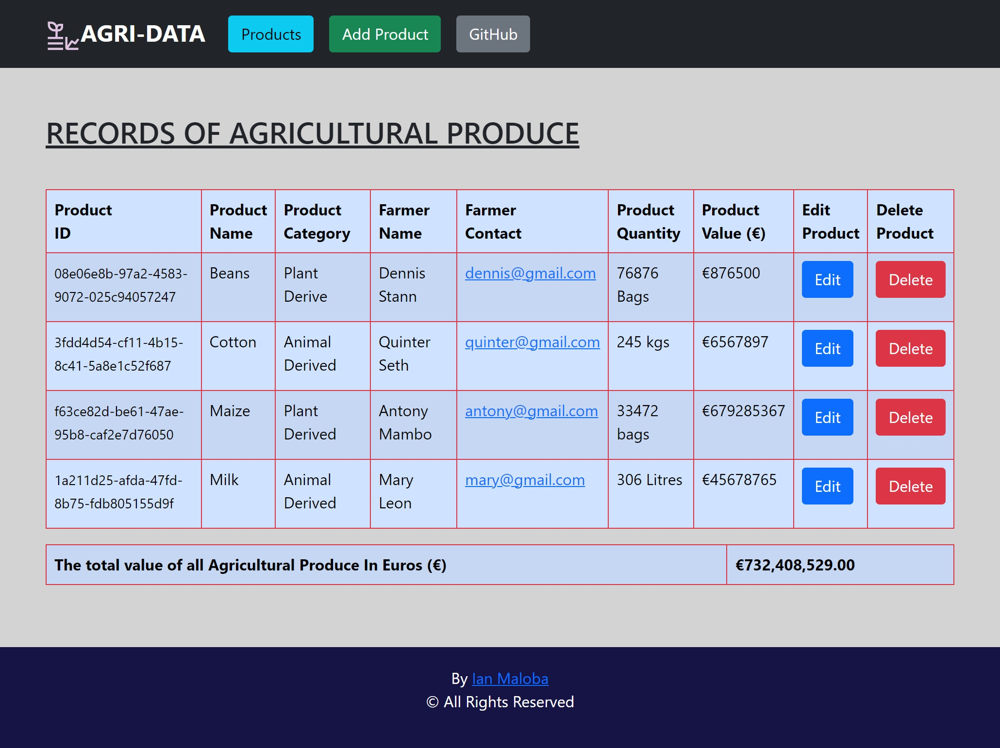

# AGRI-DATA
This is a CRUD web application with both Frontend and Backend, I have developed as a task for Hahn Softwareentwicklung. It allows Creating, Reading, Updating and Deleting  of Agricultural Produce and also computes Sum Value of Total Produce. 

NB: You can use `docker compose up --build`.

# Frontend

This project was generated with [Angular CLI](https://github.com/angular/angular-cli) version 14.0.0.

## Development server

Run `ng serve` for a dev server. Navigate to `http://localhost:4200/`. The application will automatically reload if you change any of the source files.

## Code scaffolding

Run `ng generate component component-name` to generate a new component. You can also use `ng generate directive|pipe|service|class|guard|interface|enum|module`.

## Build

Run `ng build` to build the project. The build artifacts will be stored in the `dist/` directory.

## Running unit tests

Run `ng test` to execute the unit tests via [Karma](https://karma-runner.github.io).

## Running end-to-end tests

Run `ng e2e` to execute the end-to-end tests via a platform of your choice. To use this command, you need to first add a package that implements end-to-end testing capabilities.

## Further help

To get more help on the Angular CLI use `ng help` or go check out the [Angular CLI Overview and Command Reference](https://angular.io/cli) page.

  Code Editor Used: **VS Code**

# Backend
A few relevant details:
- I used **SQL Server** as the database for this project.
- Implemented the ProductService, which controls the validation of the Entities.
- Packages used: Microsoft.EntityFrameWorkCore.SqlServer, MicrosoftEntityFrameworkCore.Tools
- Utilizing DBContext and dependency injection for enabling communication with database

  Code Editor Used: **Visual Studio**

# STARTUP:

- Clone this repository: Run `git clone https://github.com/IanMalobaMwakha/Produce-Records`

- Open the repo in a code editor, Preferably the Frontend in **VS Code** and the Backend in **Visual Studio**

- Install Packages: **Microsoft.EntityFrameWorkCore.SqlServer** and **MicrosoftEntityFrameworkCore.Tools**

- Ensure you have installed **SQL Server** in your machine
  
- Open your SQL Server, Copy the Server Name for example my SQL Server name is `server=DESKTOP-3H783EB\\SQLEXPRESS` and the click on connect to open
  
- Edit the Connection String: `ProduceRecordsConnectionString` in [appsettings.json](https://github.com/IanMalobaMwakha/Produce-Records/blob/main/Backend/Backend/Backend/appsettings.json) in line 10, replace with your respective server name
  
- A table for our database will be created in SQL Server called **ProduceRecordsDb**

- In Visual Studio, Open Package Manager Console, and Run: `Add-Migration "Initial Migration"` and then Run: `Update-Database`

- To Access the Backend Application, Run the Application by simply clicking the "Run" button on the toolbar. This will build the project, start the application, and you can observe the output in a pop-up window in your browser(The application will automatically reload upon changing any of the source files) at [https://localhost:7284/swagger/index.html](https://localhost:7284/swagger/index.html).
  
- To stop the application, press Shift + F5 or use the "Stop Debugging" button.

- Run `ng serve` and navigate to [http://localhost:4200](http://localhost:4200/) to access the Angular Front-End application.

- Now you can perform the CRUD operations in your local machine!

Verification Vedio Link: [https://drive.google.com/file/d/1wACGNKa2UMHrnzsePDP91OD5n7cwldtQ/view](https://drive.google.com/file/d/1wACGNKa2UMHrnzsePDP91OD5n7cwldtQ/view)
